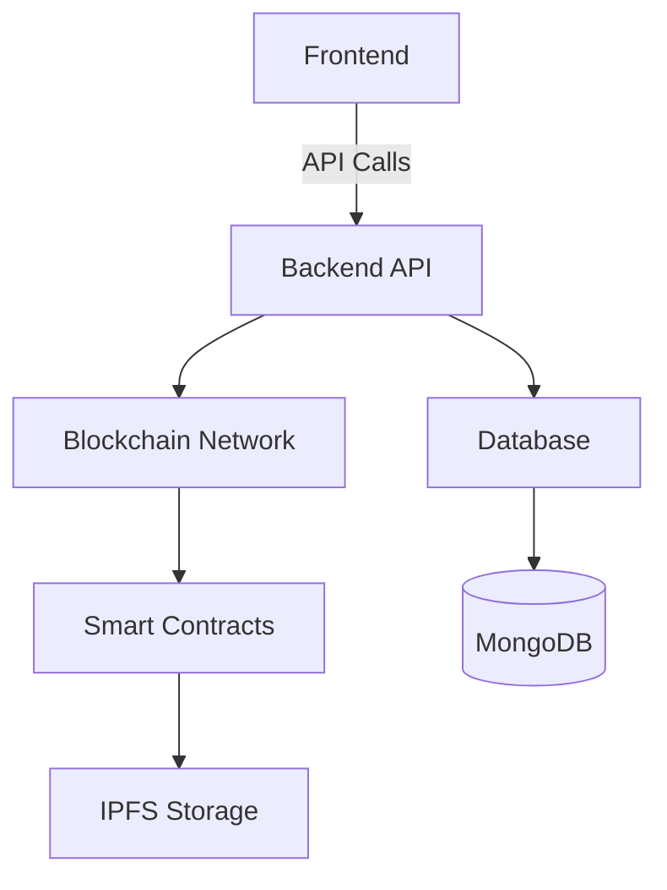

# 🚗 ChainMove - Decentralized Vehicle Financing Platform

[](https://opensource.org/licenses/MIT)
[](https://github.com/your-org/chain-move/stargazers)
[](https://discord.gg/your-invite)

ChainMove is a revolutionary blockchain-based platform that enables decentralized vehicle financing, connecting investors with drivers in emerging markets. Our platform leverages smart contracts to create transparent, secure, and efficient vehicle financing solutions.

## 🌟 Features

- **Tokenized Vehicle Ownership** - Fractional ownership of vehicles through blockchain tokens
- **Smart Contract Automation** - Automated payments, revenue sharing, and compliance
- **Decentralized Identity** - Secure KYC/AML verification
- **Real-time Analytics** - Track vehicle performance and investment returns
- **Multi-chain Support** - Built on Ethereum with Lisk L2 for low fees
- **Mobile-First** - Responsive design for all devices

## 🏗️ Architecture



## 🚀 Quick Start

### Prerequisites

- Node.js 18+
- npm 9+
- MongoDB 
- Hardhat (for smart contract development)
- MetaMask or Web3 wallet

### Installation

1. Clone the repository:
   ```bash
   git clone https://github.com/Obaijulu-gif/chain_move.git
   cd chain-move
   ```

2. Install dependencies:
   ```bash
   npm install
   ```

3. Set up environment variables:
   ```bash
   cp .env.example .env.local
   # Update the environment variables in .env.local
   ```

4. Run the development server:
   ```bash
   npm run dev
   ```

5. Open [http://localhost:3000](http://localhost:3000) in your browser.

## 📚 Documentation

- [Getting Started](docs/user-guide/getting-started.md) - Quick start guide
- [API Reference](docs/api/README.md) - Detailed API documentation
- [Smart Contracts](docs/technical/developer-guide.md) - Contract architecture and usage
- [Technical Documentation](docs/technical/setup.md) - Production deployment instructions
- [Contributing](CONTRIBUTING.md) - How to contribute to the project

## 🔧 Tech Stack

- **Frontend**: Next.js 15+, React 18+, TypeScript, Tailwind CSS
- **Backend**: Node.js, Next.js API Routes
- **Blockchain**: Solidity, Hardhat, ethers.js
- **Database**: MongoDb
- **Storage**: IPFS
- **Auth**: JWT


## 🤝 Contributing

We welcome contributions! Please read our [Contributing Guidelines](CONTRIBUTING.md) to get started.

1. Fork the repository
2. Create your feature branch (`git checkout -b feature/AmazingFeature`)
3. Commit your changes (`git commit -m 'Add some AmazingFeature'`)
4. Push to the branch (`git push origin feature/AmazingFeature`)
5. Open a Pull Request

## 📄 License

This project is licensed under the MIT License - see the [LICENSE](LICENSE) file for details.

## 🙏 Acknowledgments

- [OpenZeppelin](https://openzeppelin.com/) for battle-tested smart contracts
- [Hardhat](https://hardhat.org/) for Ethereum development environment
- [Next.js](https://nextjs.org/) for the React framework
- [Tailwind CSS](https://tailwindcss.com/) for styling

## 📬 Contact

- Email: okoyeemmanuel998@gmail.com
- Twitter: [@ChainMove1](https://twitter.com/ChainMove1)
- Telegram: [Join our community](https://discord.gg/your-invite)

---

<p align="center">
  Made with ❤️ by the ChainMove Team
</p>
