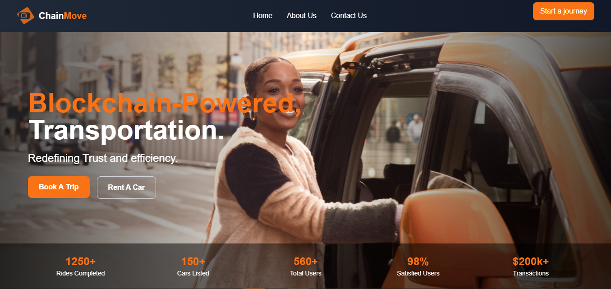
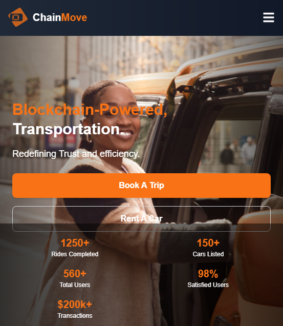
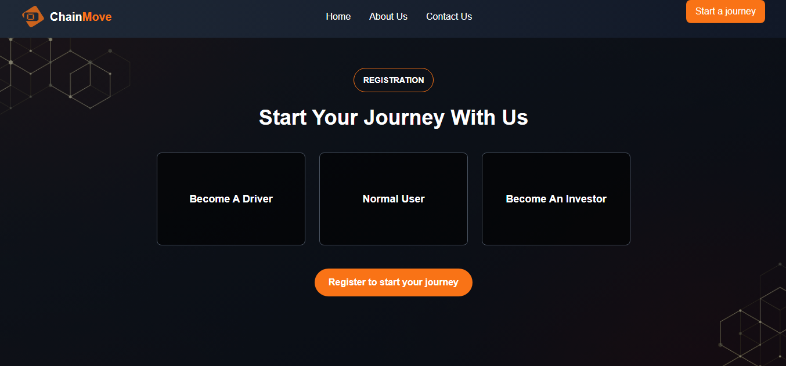

# 🚗 ChainMove – Decentralized Transportation on EVM-Compatible Chains

Welcome to **ChainMove**, the blockchain-powered Transportation platform transforming mobility services. Leveraging blockchain technology, **ChainMove** ensures secure payments, driver incentives, and ride transparency for both passengers and drivers. Our mission is to empower users with a seamless, transparent, and trusted experience.



---

## 🌟 **Overview**

ChainMove simplifies ride management and payments using smart contracts on the **Request Network**. By securing transactions and ensuring transparency, we create a reliable platform for drivers and passengers. 

### Key Highlights:
- **Upfront Security**: Drivers receive 10% of the fare immediately upon booking.
- **Completion-Based Incentives**: The remaining 90% is released upon passenger confirmation of ride completion.
- **Secure Authentication**: Users are authenticated via blockchain for enhanced safety.

---

## 🎯 **Key Features**

1. **Blockchain-Powered Ride Booking**: Passengers book rides with guaranteed payment security and driver incentives.
2. **Request Network SDK** is used to create and pay for rides, and also used to retrieve information about all the created rides and individual rides.
2. **Interactive Ride Management**: Real-time updates for drivers and passengers through a dynamic UI showing the status of each ride
4. **Secure Payments**: Built on **Request Network**, ensuring tamper-proof transactions and transparent records, as every transaction is being saved to the blockchain.
5. **Driver and Passenger Dashboard**: Intuitive dashboards to manage bookings, ride details, and payment histories.

6. **Ride Invoice Generation**: Automatically generates downloadable and shareable ride invoices as PDFs.
7. **Interactive Map Integration**: View and select routes via interactive maps.

---

## 🛠️ **Technologies Used**

ChainMove utilizes a modern tech stack to create a robust decentralized platform:

- **Next.js**: Provides a dynamic, responsive, and performant UI.
- **Request Network**: Handles secure payment processing and transaction logging.
- **Wagmi**: Ensures decentralized and secure user authentication.
- **Tailwind CSS**: Enables fast, elegant, and responsive design.
- **Leaflet.js**: Interactive maps for route visualization and navigation.

---

## 📐 **Architecture**

The **ChainMove** architecture ensures scalability, security, and user convenience through its modular design:

1. **Frontend**: Built with **Next.js**, offering a seamless user experience for ride booking, driver registration, and dashboard management.
2. **Backend**: Smart contracts handle ride bookings, payments, and confirmations securely on the **Request Network**.
3. **Authentication**: Decentralized login through blockchain-based methods ensures secure user identity verification.


---

## 🚀 **Getting Started**

Follow these steps to set up and run **ChainMove** locally:

### **Prerequisites**
- **Node.js** (v14+)
- **npm**

### **Installation**

1. **Clone the repository**:
   ```bash
   git clone https://github.com/obiajulu-gif/chainmove.git
   cd chainmove
   ```

2. **Install dependencies**:
   ```bash
   npm install
   ```

3. **Start the development server**:
   ```bash
   npm run dev
   ```

4. **Install additional packages** (if necessary):
   ```bash
   npm install <package_name> --legacy-peer-deps
   ```

Visit `http://localhost:3000` in your browser to access **ChainMove**.

---

## 💡 **Payment Flow with Smart Contracts**

ChainMove integrates **Request Network** smart contracts to manage secure, transparent payments. 

### **Smart Contract Workflow**
1. **Booking Confirmation**: Logs ride details, including fare, driver, and passenger.
2. **Ride Completion**: Releases the fare when the passenger confirms ride completion.
3. **Earnings Management**: Drivers earnings are sent directly to their wallet address via Request Network smart contracts.

### Code Snippet
Here’s an example of a ride booking and payment contract:

```javascript
import { RequestNetwork } from "@requestnetwork/request-client.js";

const requestClient = new RequestNetwork({
  nodeConnectionConfig: {
    baseURL: "https://sepolia.gateway.request.network/",
  },
});

async function createRideTransaction(rideDetails) {
  const request = await requestClient.createRequest({
    requestInfo: {
      currency: { type: "ETH", network: "sepolia" },
      expectedAmount: rideDetails.amount,
      payee: { type: "ETHEREUM_ADDRESS", value: rideDetails.driverAddress },
    },
    paymentNetwork: {
      id: "ETH_INPUT_DATA",
      parameters: { paymentAddress: rideDetails.driverAddress },
    },
    contentData: rideDetails.details,
  });

  console.log("Transaction created:", request.requestId);
  return request;
}
```

---

## 🔒 **Authentication**

**ChainMove** ensures secure authentication for all users:
- **Drivers and Passengers** log in securely using decentralized blockchain-based methods.
- Eliminates reliance on centralized login systems, enhancing user data security.

---

## 📱 **Screenshots**

### **Mobile View Page**


### **Driver Registration**


---

## 🤝 **Team Members**

Meet the people building **ChainMove**:

- **Emmanuel Okoye** – *Team Lead and Full Stack Developer*: Led the development of the Next.js frontend and blockchain integrations.
- **Damian Olebuezie** – *Blockchain Developer*: Architected smart contracts and integrated **Request Network** for payments.
- **Victoria Nwogu** – *Product Manager*: Planned features and managed project timelines.
- **David Emulo** – *UI/UX Designer*: Designed user-friendly interfaces and visual elements.
- **Engr. Mikailu Nadro** – *Technical Advisor*: Provided strategic blockchain and scaling guidance.
- **Israel Nwafor** – *Community Manager*: Built and fostered an active user community.

---

## 🤝 **Contributing**

We welcome contributions to improve **ChainMove**! 
- Fork the repository.
- Make your changes.
- Submit a pull request.

---

## 📝 **License**

This project is licensed under the **MIT License**.

---

### Join the ride-sharing revolution with **ChainMove**—secure, decentralized, and user-first transportation! 🚗