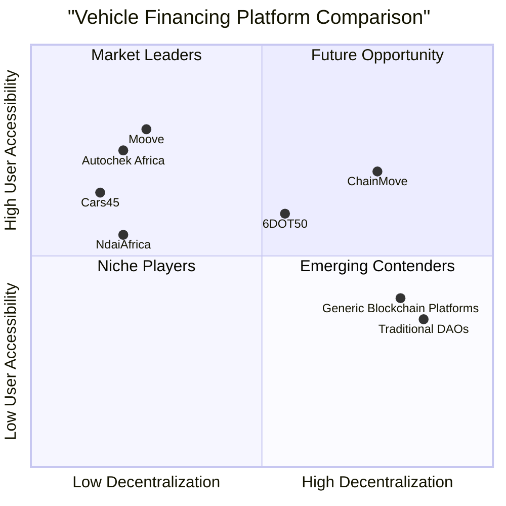

# ChainMove Product Requirements Document (PRD)

## 1. Introduction

### 1.1 Purpose

This document outlines the product requirements for ChainMove, a decentralized, blockchain-powered vehicle financing platform. ChainMove enables transparent, flexible loans for various mobility assets including cars, motorcycles, tricycles, and trucks through a DAO-driven governance model.

### 1.2 Project Overview

ChainMove is building a Web3 solution for vehicle financing that empowers drivers and entrepreneurs with instant, transparent access to vehicle financing, while enabling investors to participate in a secure, decentralized funding ecosystem. The platform will be built on the Lisk Layer 2 blockchain, with a modern, mobile-first approach using Next.js, Tailwind CSS, and React Icons for the frontend, and MongoDB for database management.

### 1.3 Requirements Summary

- A responsive, mobile-optimized web application
- Two distinct user groups: Drivers/Users and Investors
- Smart contract-powered loan disbursement and repayments
- DAO governance for investment decisions
- Tokenization for fractional ownership of mobility assets
- Integration with blockchain wallets for authentication and transactions
- Comprehensive dashboards for both user groups
- Vehicle listing and loan application systems
- KYC system for user verification

## 2. Product Definition

### 2.1 Product Goals

1. **Financial Inclusion**: Create a decentralized financing platform that provides access to mobility asset financing for unbanked or underbanked individuals through alternative credit scoring.

2. **Investment Democratization**: Enable fractional ownership of mobility assets through tokenization, allowing investors of various financial capabilities to participate in funding.

3. **Operational Efficiency**: Reduce costs and increase transparency in vehicle financing by automating loan disbursement and repayments through smart contracts, eliminating traditional intermediaries.

### 2.2 User Stories

#### Driver/User Stories

1. As a driver, I want to browse available vehicles for financing so that I can find a mobility asset that suits my needs and income level.

2. As a user without traditional banking history, I want alternative methods to prove my creditworthiness so that I can access vehicle financing despite lacking a conventional credit score.

3. As a borrower, I want transparent loan terms and automatic repayment processing so that I can easily track my ownership progress and avoid manual payment hassles.

4. As a mobility entrepreneur, I want to see detailed vehicle specifications and financing options so that I can make informed decisions about which asset will provide the best return on investment for my business.

#### Investor Stories

1. As an investor, I want to initiate crowdfunding for mobility assets so that I can create investment opportunities aligned with market demand.

2. As an investor, I want to browse ongoing funding opportunities so that I can join existing investments that match my risk profile and expected returns.

3. As a DAO member, I want to participate in governance decisions so that I can help shape the platform's loan policies and risk management strategies.

4. As an investor, I want real-time updates on the performance of my investments so that I can track returns and make informed decisions about future investments.

### 2.3 Competitive Analysis

#### Web2 Competitors

1. **Autochek Africa**
   - Pros: Comprehensive marketplace connecting buyers, sellers, dealers, and financiers; partnerships with 70+ financial institutions; vehicle inspection services
   - Cons: Centralized system; reliance on traditional banking infrastructure; limited to specific African countries

2. **Moove**
   - Pros: Revenue-based repayment model; alternative credit scoring through ride-hailing platform integration; quick approval process; EV focus
   - Cons: Primarily focused on ride-hailing drivers; centralized decision-making; traditional financing structure

3. **Cars45**
   - Pros: Strong focus on Nigerian market; inspection services; partnerships with financial institutions; includes Nigerian-used cars
   - Cons: Limited geographic scope; traditional financing requirements; centralized marketplace

4. **NdaiAfrica**
   - Pros: Lease-to-own model for mobility entrepreneurs; focus on East/Central Africa regions; driver-centric approach
   - Cons: Limited information available; appears to use traditional financing methods; centralized control

#### Web3 Competitors

5. **6DOT50**
   - Pros: Enables crypto payments for vehicle purchases; partnership with 1,400+ dealerships; supports multiple cryptocurrencies
   - Cons: Limited to payment processing; doesn't offer full financing solution; primarily South Africa-focused; not fully decentralized

6. **Generic Blockchain Vehicle Platforms**
   - Pros: Utilize smart contracts for automation; provide immutable vehicle history; enable peer-to-peer transactions
   - Cons: Limited mainstream adoption; technical barriers for average users; regulatory uncertainties

7. **Traditional DAO Investment Platforms**
   - Pros: Decentralized governance; collective decision-making; fractional ownership through tokens
   - Cons: Not specifically designed for vehicle financing; complex for non-crypto natives; potential regulatory challenges

### 2.4 Competitive Quadrant Chart



## 3. User Personas

### 3.1 Driver/User Personas

#### Entrepreneurial Driver - Samuel

**Demographics:**
- 28 years old
- Urban resident in Lagos, Nigeria
- Secondary education
- Currently renting a vehicle for ride-hailing

**Goals:**
- Own a vehicle to increase earnings
- Build a small fleet over time
- Establish financial credibility

**Pain Points:**
- Limited access to traditional financing due to lack of credit history
- High upfront costs for vehicle purchase
- Opaque terms from traditional lenders
- Unpredictable income makes fixed payments difficult

**Motivations:**
- Financial independence
- Business growth
- Asset ownership

#### Delivery Business Owner - Amina

**Demographics:**
- 35 years old
- Runs a small delivery service
- Technical college education
- Uses borrowed vehicles

**Goals:**
- Expand business with own fleet of delivery vehicles
- Increase reliability of service
- Build business credit

**Pain Points:**
- Banks require extensive collateral
- Limited financing options for business vehicles
- Cash flow variability makes traditional loans risky

**Motivations:**
- Business expansion
- Service reliability
- Customer satisfaction

### 3.2 Investor Personas

#### Individual Crypto Investor - Marcus

**Demographics:**
- 32 years old
- Software developer
- Urban resident
- Experienced crypto investor

**Goals:**
- Diversify crypto portfolio into real-world assets
- Generate passive income
- Support financial inclusion initiatives

**Pain Points:**
- Limited real-world applications for crypto
- High volatility in pure crypto investments
- Difficulty finding transparent investment opportunities

**Motivations:**
- Financial returns
- Portfolio diversification
- Social impact

#### Institutional DAO Participant - Global Mobility Fund

**Demographics:**
- DAO with 500+ members
- Focused on mobility investments
- Globally distributed membership
- Various levels of crypto expertise

**Goals:**
- Deploy capital into high-impact mobility solutions
- Generate returns for DAO members
- Scale decentralized financing model

**Pain Points:**
- Difficulty coordinating large-scale investment decisions
- Limited infrastructure for real-world asset tokenization
- Regulatory complexities across jurisdictions

**Motivations:**
- Systematic returns
- Governance participation
- Market transformation

## 4. Technical Specifications

### 4.1 Requirements Analysis

ChainMove requires a robust technical architecture that supports blockchain integration, smart contract functionality, and a user-friendly interface. The system must handle two distinct user journeys (drivers/users and investors) while maintaining high security standards for financial transactions.

The platform will be built using:
- **Frontend**: Next.js, Tailwind CSS, React Icons
- **Backend**: MongoDB for off-chain data storage
- **Blockchain**: Lisk Layer 2 for smart contracts and transactions
- **Authentication**: Dual support for Web3 (wallet connection) and traditional (email/password) authentication

The system must be highly responsive across all devices, with special attention to mobile optimization, as many users in target markets primarily access the internet via mobile devices.

### 4.2 Requirements Pool

#### P0 (Must-Have) Requirements

1. **User Authentication System**
   - Web3 authentication via wallet connection
   - Traditional authentication via email/password
   - Third-party authentication options
   - KYC integration for user verification

2. **Vehicle Listing Module**
   - Comprehensive database of available vehicles
   - Filtering and search functionality
   - Detailed vehicle specifications
   - Status indicators (available, funding, financed)

3. **Loan Application System**
   - Multi-step application form
   - Personal information collection
   - Income verification
   - Loan preference selection

4. **Investor Dashboard**
   - Investment opportunity listings
   - Portfolio performance metrics
   - Funding initiation interface
   - Investment management tools

5. **Driver/User Dashboard**
   - Loan application status
   - Repayment tracking
   - Vehicle information
   - Payment processing

6. **Wallet Integration**
   - Connect multiple wallet types
   - View token balances
   - Execute transactions
   - Sign blockchain messages

7. **Landing Page**
   - Platform introduction
   - Video showcase
   - Vehicle listings preview
   - User registration paths

8. **Smart Contract System**
   - Loan origination contracts
   - Repayment automation
   - Investor fund management
   - DAO governance

#### P1 (Should-Have) Requirements

1. **Announcements System**
   - Platform updates
   - New vehicle listings
   - Investment opportunities
   - Educational content

2. **Analytics Dashboard**
   - Investment performance metrics
   - Loan repayment statistics
   - Vehicle utilization data
   - Market trends

3. **DAO Governance Portal**
   - Proposal creation and voting
   - Governance token management
   - Voting history and results
   - Implementation tracking

4. **Alternative Credit Scoring**
   - Integration with non-traditional data sources
   - Behavioral scoring model
   - Revenue prediction algorithms
   - Risk assessment tools

5. **Notification System**
   - In-platform alerts
   - Email notifications
   - Mobile push notifications
   - Blockchain transaction alerts

#### P2 (Nice-to-Have) Requirements

1. **Mobile Application**
   - Native iOS and Android apps
   - Offline functionality
   - Push notifications
   - Biometric authentication

2. **Vehicle Tracking Integration**
   - GPS-based location tracking
   - Utilization monitoring
   - Maintenance scheduling
   - Performance analytics

3. **Secondary Market**
   - Investment token trading
   - Ownership transfer system
   - Market making functionality
   - Price discovery mechanisms

4. **Multi-language Support**
   - Multiple African languages
   - Major international languages
   - Localization framework
   - Regional customization

5. **Gamification Elements**
   - Rewards for on-time payments
   - Investment achievement badges
   - Community rankings
   - Loyalty program

### 4.3 UI Design Draft

#### Landing Page Layout

```
+-------------------------------------------------+
|  LOGO   NAV LINKS               CONNECT WALLET  |
+-------------------------------------------------+
|                                                 |
|       HERO SECTION WITH BOLD TAGLINE            |
|       & CALL-TO-ACTION BUTTONS                  |
|                                                 |
+-------------------------------------------------+
|                                                 |
|       VIDEO SECTION EXPLAINING CHAINMOVE        |
|                                                 |
+-------------------------------------------------+
|                                                 |
|       HOW IT WORKS (STEP-BY-STEP)              |
|                                                 |
+-------------------------------------------------+
|                                                 |
|       FEATURED VEHICLES                         |
|  +--------+  +--------+  +--------+  +-------+ |
|  |        |  |        |  |        |  |       | |
|  | VEHICLE|  | VEHICLE|  | VEHICLE|  |VEHICLE| |
|  |   1    |  |   2    |  |   3    |  |   4   | |
|  |        |  |        |  |        |  |       | |
|  +--------+  +--------+  +--------+  +-------+ |
|                                                 |
+-------------------------------------------------+
|                                                 |
|       INVESTOR SECTION                          |
|                                                 |
+-------------------------------------------------+
|                                                 |
|       DRIVER SECTION                            |
|                                                 |
+-------------------------------------------------+
|                                                 |
|       FOOTER                                    |
|                                                 |
+-------------------------------------------------+
```

#### Dashboard Layout (Driver/User)

```
+--------------------------------------------------+
|  LOGO           NOTIFICATIONS    USER PROFILE    |
+--------+---------------------------------------+--+
|        |                                       |  |
|        |  WELCOME BACK, [NAME]                |  |
|        |  Quick Stats & Alerts                |  |
|        |                                       |  |
|        +---------------------------------------+  |
|        |                                       |  |
| SIDEBAR|  MY VEHICLES                          |N |
|        |  [Vehicle cards with status]          |O |
| - Home |                                       |T |
|        +---------------------------------------+I |
| - My   |                                       |F |
|  Loans |  LOAN STATUS                          |I |
|        |  [Progress bars, payment info]        |C |
| - Find |                                       |A |
|  Vehicle+---------------------------------------+T |
|        |                                       |I |
| - Profile  PAYMENT HISTORY                     |O |
|        |  [Transaction table]                  |N |
| - Help |                                       |S |
|        +---------------------------------------+  |
|        |                                       |  |
|        |  RECOMMENDED VEHICLES                 |  |
|        |  [New opportunities]                  |  |
|        |                                       |  |
+--------+---------------------------------------+--+
```

#### Dashboard Layout (Investor)

```
+--------------------------------------------------+
|  LOGO           NOTIFICATIONS    USER PROFILE    |
+--------+---------------------------------------+--+
|        |                                       |  |
|        |  INVESTMENT PORTFOLIO OVERVIEW        |  |
|        |  [Charts, key metrics]                |  |
|        |                                       |  |
|        +---------------------------------------+  |
|        |                                       |  |
| SIDEBAR|  ACTIVE INVESTMENTS                   |N |
|        |  [Vehicle investments with status]    |O |
| - Home |                                       |T |
|        +---------------------------------------+I |
| - My   |                                       |F |
|Investments FUNDING OPPORTUNITIES               |I |
|        |  [New vehicle funding options]        |C |
| - Create+---------------------------------------+A |
|  Fund  |                                       |T |
|        |  DAO GOVERNANCE                        |I |
| - DAO  |  [Active proposals, voting]           |O |
|        |                                       |N |
| - Reports                                      |S |
|        +---------------------------------------+  |
|        |                                       |  |
| - Profile  REPAYMENT ANALYTICS                 |  |
|        |  [Performance metrics]                |  |
|        |                                       |  |
+--------+---------------------------------------+--+
```

#### Loan Application Form Layout

```
+--------------------------------------------------+
|                                                  |
|  LOAN APPLICATION                                |
|                                                  |
|  [Progress indicator: 1-2-3-4]                   |
|                                                  |
|  +--------------------------------------------+  |
|  |                                            |  |
|  |  SECTION TITLE (e.g., "Quick Information") |  |
|  |                                            |  |
|  |  [Form fields relevant to current section] |  |
|  |                                            |  |
|  |  [Input fields with validation]            |  |
|  |                                            |  |
|  +--------------------------------------------+  |
|                                                  |
|  [Previous]                [Next/Submit]         |
|                                                  |
+--------------------------------------------------+
```

### 4.4 Open Questions

1. **Regulatory Compliance**
   - What specific regulatory requirements must be addressed in each target market?
   - How will KYC/AML compliance be handled across different jurisdictions?

2. **Risk Management**
   - What mechanisms will be implemented to handle loan defaults?
   - How will vehicle collateral be managed in case of repayment failure?

3. **Blockchain Scalability**
   - How will the Lisk Layer 2 blockchain handle transaction volume as the platform scales?
   - What contingencies exist for blockchain network congestion?

4. **Integration Capabilities**
   - Which ride-hailing and logistics platforms will be prioritized for partnerships?
   - What APIs and integration points need to be developed for these partnerships?

5. **User Education**
   - How will non-crypto native users be onboarded to Web3 functionality?
   - What educational resources will be provided to explain decentralized financing?

## 5. User Flows

### 5.1 Driver/User Registration Flow

1. User visits ChainMove landing page
2. User clicks "Get Started" or "Apply for Financing"
3. User selects registration method:
   - Connect Wallet (Web3)
   - Email/Password (Web2)
   - Third-party authentication
4. User completes basic profile information
5. User is directed to KYC verification process
6. Upon successful verification, user completes profile with additional details
7. User is directed to the Driver/User Dashboard

### 5.2 Investor Registration Flow

1. User visits ChainMove landing page
2. User clicks "Invest" or "Become an Investor"
3. User selects registration method:
   - Connect Wallet (Web3) - Primary method
   - Email/Password with additional verification (Web2)
4. User completes investor profile information
5. User undergoes enhanced KYC/AML verification
6. User is prompted to add funds to investment wallet
7. User is directed to the Investor Dashboard

### 5.3 Vehicle Browsing and Application Flow

1. Driver/User navigates to "Find Vehicle" section
2. User filters available vehicles by type, price range, purpose, etc.
3. User selects a vehicle to view detailed information
4. User clicks "Apply for Financing"
5. User completes the multi-step loan application:
   - Quick Information
   - About Me
   - Loan Preferences
   - Review and Submit
6. User receives confirmation of application submission
7. User can track application status in dashboard

### 5.4 Investor Funding Initiation Flow

1. Investor navigates to "Create Fund" section
2. Investor selects vehicle type(s) for funding
3. Investor sets funding parameters:
   - Total funding amount
   - Minimum investment threshold
   - Expected return rate
   - Funding duration
4. Investor reviews and confirms funding details
5. Smart contract is generated for the funding pool
6. Funding opportunity is published to the platform
7. Investor can track funding progress in dashboard

### 5.5 Investment Participation Flow

1. Investor navigates to "Funding Opportunities" section
2. Investor browses available funding options
3. Investor selects a funding opportunity to view details
4. Investor specifies investment amount
5. Investor reviews and confirms investment
6. Smart contract processes the investment transaction
7. Investor receives confirmation and investment tokens
8. Investment appears in investor's portfolio

## 6. UI/UX Guidelines

### 6.1 Brand Identity

- **Primary Color**: HEX:E57700 (Orange)
- **Secondary Colors**:
  - Dark Blue: #142841
  - Light Blue: #3A7CA5
  - Light Gray: #F5F7FA
  - White: #FFFFFF

- **Typography**:
  - Headings: Montserrat Bold
  - Body: Inter Regular
  - Buttons: Montserrat Medium
  
- **Logo Usage**:
  - Full logo for desktop navigation
  - Icon-only logo for mobile navigation
  - Maintain clear space equal to "C" height around logo

### 6.2 Design System

- **Buttons**:
  - Primary: HEX:E57700 with white text
  - Secondary: White with HEX:E57700 border and text
  - Tertiary: Light Gray with Dark Blue text
  - Disabled: #D1D5DB with #9CA3AF text

- **Forms**:
  - Input fields with subtle border
  - Clear validation states (success, error, focus)
  - Floating labels for better space utilization
  - Inline validation messages

- **Cards**:
  - Light shadow
  - Rounded corners (8px radius)
  - Consistent padding (16px)
  - Optional hover states for interactive cards

- **Icons**:
  - Use React Icons library
  - Consistent sizing within contexts
  - Meaningful icons with text labels where appropriate

### 6.3 Responsive Design Guidelines

- **Mobile-First Approach**:
  - Design for smallest screens first
  - Progressive enhancement for larger screens
  - Touch-friendly tap targets (minimum 44x44px)

- **Breakpoints**:
  - Extra Small: < 640px
  - Small: 640px
  - Medium: 768px
  - Large: 1024px
  - Extra Large: 1280px

- **Navigation**:
  - Hamburger menu for mobile
  - Visible navigation bar for tablet and up
  - Collapsible sidebar for dashboards

### 6.4 Animation Guidelines

- **Principles**:
  - Purposeful: Animations should guide users and provide feedback
  - Subtle: Avoid distracting or excessive movements
  - Performant: Optimize for low-powered devices

- **Transitions**:
  - Page transitions: Fade (150ms)
  - Modal/dialog: Scale and fade (200ms)
  - Element transitions: Ease-in-out (250ms)

- **Interactive Elements**:
  - Button hover/active states
  - Form field focus states
  - Loading indicators for async operations
  - Success/error animations for feedback

## 7. Implementation Considerations

### 7.1 Technology Stack

- **Frontend**:
  - Next.js for server-side rendering and SEO optimization
  - Tailwind CSS for utility-first styling
  - React Icons for consistent iconography
  - Framer Motion for animations

- **Backend**:
  - MongoDB for database management
  - Node.js/Express for API development
  - JWT for authentication (Web2)
  - Web3.js/ethers.js for blockchain interactions

- **Blockchain**:
  - Lisk Layer 2 blockchain
  - Smart contracts for loan management and DAO governance
  - IPFS for decentralized document storage

- **DevOps**:
  - Containerization with Docker
  - CI/CD pipeline
  - AWS/GCP for cloud infrastructure

### 7.2 Security Considerations

- **Authentication**:
  - Multi-factor authentication for sensitive operations
  - Secure wallet connection protocols
  - Session management and timeout controls

- **Data Protection**:
  - Encryption of sensitive user information
  - Minimization of on-chain personal data
  - Secure API endpoints with rate limiting

- **Smart Contract Security**:
  - Formal verification of critical contracts
  - Comprehensive testing and auditing
  - Upgrade mechanisms for contract improvements

- **KYC Security**:
  - Compliance with data protection regulations
  - Secure storage of verification documents
  - Limited access to personal identification data

### 7.3 Scalability Planning

- **User Growth**:
  - Horizontal scaling of web servers
  - Database sharding for increased load
  - CDN implementation for static assets

- **Transaction Volume**:
  - Layer 2 optimization for high transaction throughput
  - Batched transactions where appropriate
  - Queue systems for peak load management

- **Geographic Expansion**:
  - Region-specific deployments
  - Localization infrastructure
  - Regulatory compliance framework by jurisdiction

### 7.4 Monitoring and Analytics

- **Performance Monitoring**:
  - Real-time application monitoring
  - Blockchain transaction tracking
  - Error logging and alerting

- **User Analytics**:
  - Conversion funnel analysis
  - User journey mapping
  - Feature usage metrics

- **Business Metrics**:
  - Loan origination volume
  - Investment participation rates
  - Repayment performance
  - Default rates and risk indicators

## 8. Launch Strategy

### 8.1 Development Phases

1. **Alpha Phase (2 months)**:
   - Core platform architecture
   - Basic user authentication
   - Smart contract development
   - Simplified vehicle listing

2. **Beta Phase (3 months)**:
   - Complete user flows
   - Dashboard implementation
   - DAO governance features
   - Limited market testing

3. **MVP Launch (1 month)**:
   - Full functionality for core features
   - Production environment deployment
   - Security audits and testing
   - Initial market rollout

4. **Post-Launch Iterations**:
   - Feature enhancements based on feedback
   - Performance optimizations
   - Expansion to additional markets
   - Advanced feature development

### 8.2 Marketing Approach

- **Target Audiences**:
  - Mobility entrepreneurs and drivers
  - Crypto investors and DAOs
  - Vehicle dealerships and fleets
  - Ride-hailing and logistics platforms

- **Key Channels**:
  - Digital marketing focusing on crypto and mobility communities
  - Partnerships with ride-hailing/logistics platforms
  - Dealership network development
  - Web3 community engagement

- **Value Proposition Messaging**:
  - For Drivers: "Own Your Path: Transparent, Flexible Vehicle Financing"
  - For Investors: "Fund Mobility, Fuel Growth: Secure, Decentralized Returns"

### 8.3 Success Metrics

- **User Acquisition**:
  - Driver registrations and completed applications
  - Investor onboarding and funding participation
  - Conversion rates at each funnel stage

- **Financial Performance**:
  - Total vehicle financing originated
  - Average investment size and count
  - Repayment rates and defaults
  - Platform fee revenue

- **Platform Health**:
  - Smart contract execution success rate
  - System uptime and performance
  - User satisfaction scores
  - Retention and engagement metrics 

## 9. Conclusion

ChainMove represents a significant innovation in vehicle financing by combining the transparency and efficiency of blockchain technology with the practical needs of mobility entrepreneurs and investors. By focusing on a mobile-first, user-friendly experience while leveraging the power of decentralized finance, the platform has the potential to transform vehicle ownership access across markets.

The implementation requires careful attention to both technical blockchain elements and intuitive user experience design to bridge the gap between Web3 capabilities and practical user needs. By executing this PRD effectively, ChainMove will create a sustainable ecosystem that benefits all stakeholders while pioneering a new model for asset financing.
