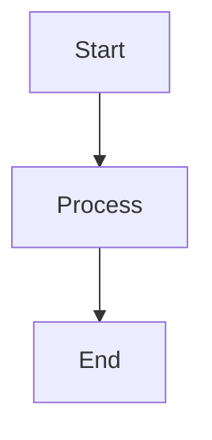
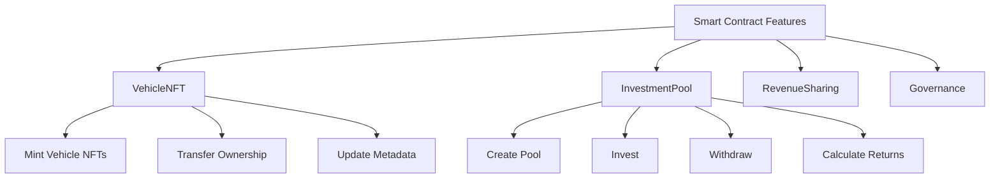
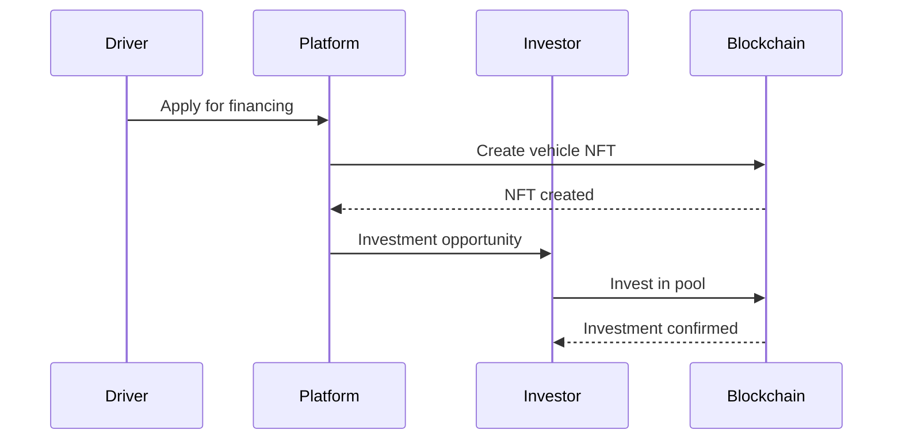
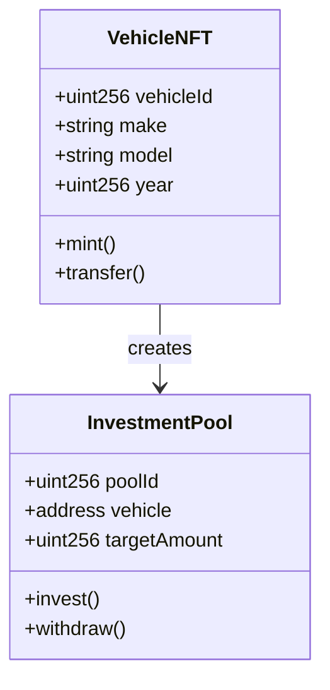
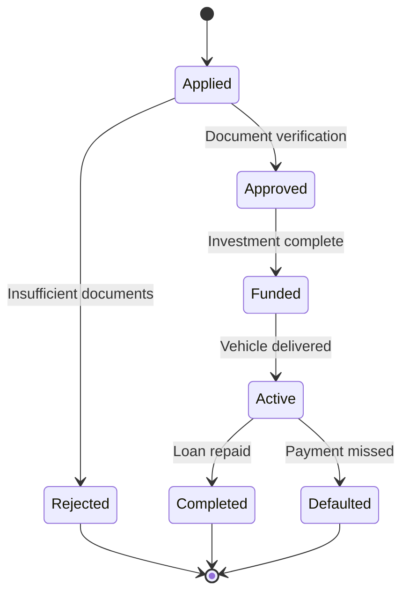
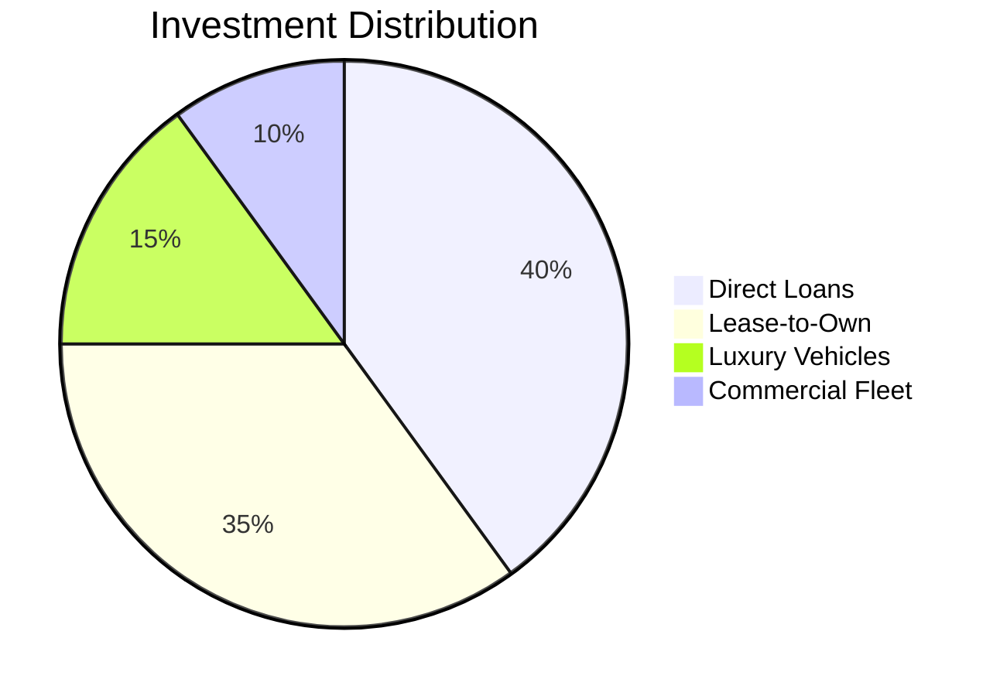
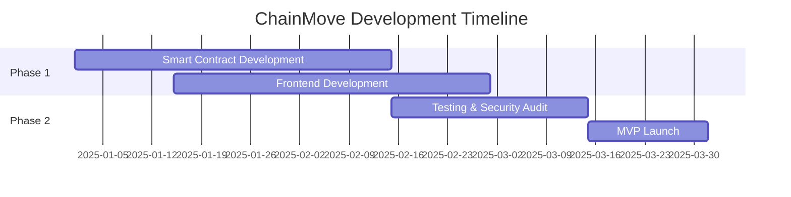
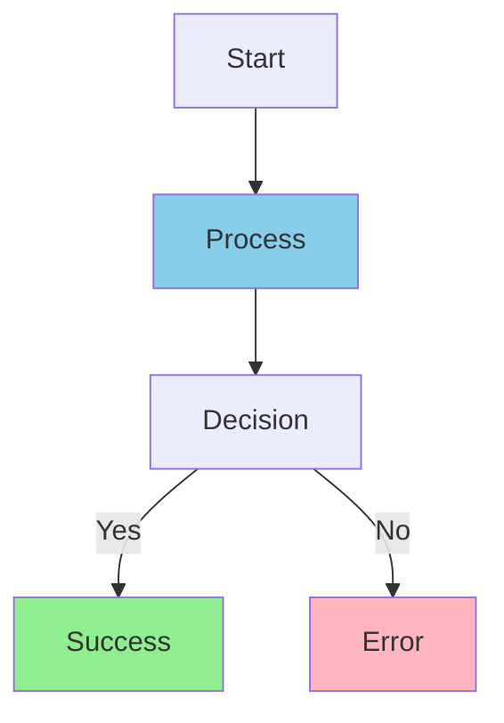
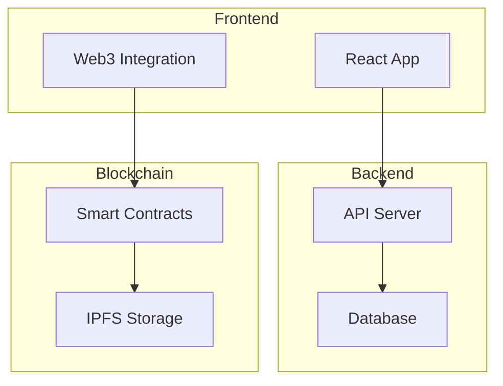

# How to Create Mermaid Diagrams

This guide explains how to create and use Mermaid diagrams in your Docusaurus documentation.

## What is Mermaid?

Mermaid is a JavaScript-based diagramming and charting tool that uses text-based definitions to create diagrams. It's now properly configured in your Docusaurus site.

## Basic Syntax

To create a Mermaid diagram, wrap your diagram code in a code block with the `mermaid` language identifier:

````markdown

````

## Common Diagram Types

### 1. Flowcharts



### 2. Sequence Diagrams



### 3. Class Diagrams



### 4. State Diagrams



### 5. Pie Charts



### 6. Gantt Charts



## Tips for Better Diagrams

1. **Keep it Simple**: Don't overcomplicate diagrams with too many elements
2. **Use Clear Labels**: Make node and edge labels descriptive
3. **Consistent Styling**: Use consistent colors and shapes for similar elements
4. **Logical Flow**: Ensure the flow direction makes sense (usually top-to-bottom or left-to-right)

## Color and Styling

You can add custom styling to your diagrams:



## Advanced Features

### Subgraphs



## Best Practices

1. **Test your diagrams**: Always preview diagrams before committing
2. **Use meaningful names**: Avoid generic labels like "Node1", "Process2"
3. **Document complex diagrams**: Add explanatory text above or below complex diagrams
4. **Keep diagrams focused**: One diagram should illustrate one concept or process
5. **Update diagrams**: Keep diagrams in sync with code and documentation changes

## Troubleshooting

If your diagrams aren't rendering:

1. Check that the code block uses the `mermaid` language identifier
2. Verify the syntax is correct (use [Mermaid Live Editor](https://mermaid.live) to test)
3. Ensure there are no special characters that might break parsing
4. Check the browser console for any JavaScript errors

For more advanced Mermaid features, visit the [official Mermaid documentation](https://mermaid.js.org/). 