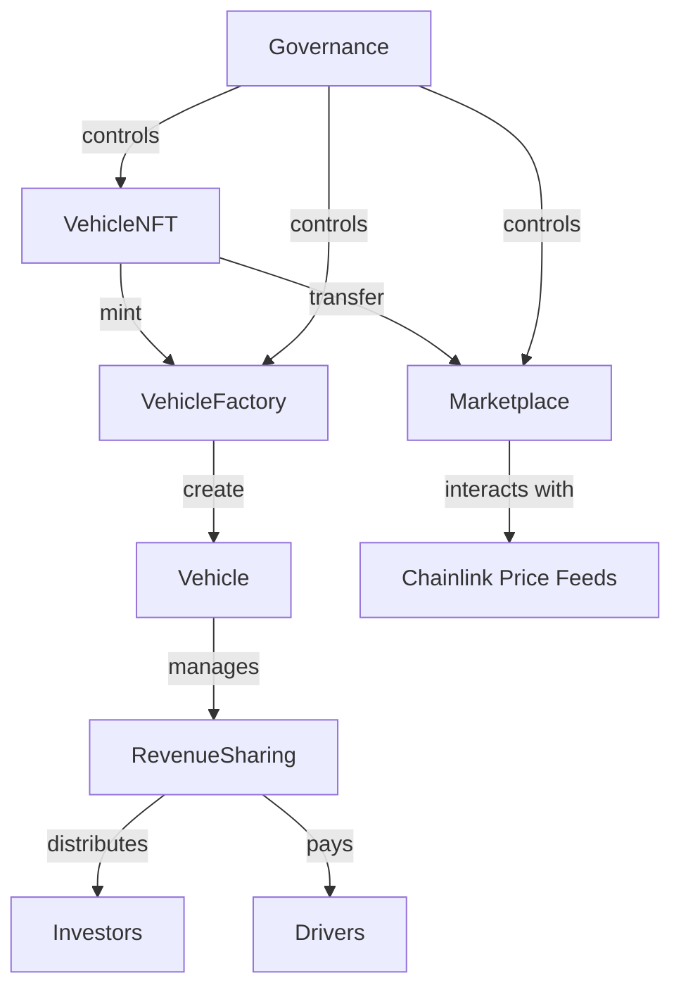

# 🔗 Smart Contracts

This document provides comprehensive documentation for ChainMove's smart contracts, including architecture, deployment, and interaction guides.

## 📜 Contract Architecture



## 🏗️ Core Contracts

### 1. VehicleNFT (ERC-721)

Non-fungible token representing ownership of vehicles on the blockchain.

**Key Functions:**

```solidity
// Mint a new vehicle NFT
function mint(
    address to,
    string memory vin,
    string memory make,
    string memory model,
    uint256 year,
    uint256 price
) external returns (uint256);

// Get vehicle details by token ID
function getVehicleDetails(uint256 tokenId) 
    external 
    view 
    returns (
        string memory vin,
        string memory make,
        string memory model,
        uint256 year,
        uint256 price,
        address owner,
        bool isFinanced
    );
```

### 2. VehicleFactory

Factory contract for creating and managing vehicle NFTs.

**Key Functions:**

```solidity
// Create a new vehicle
function createVehicle(
    string memory vin,
    string memory make,
    string memory model,
    uint256 year,
    uint256 price,
    address initialOwner
) external onlyOwner returns (uint256);

// List of all vehicles created by the factory
function getAllVehicles() external view returns (uint256[] memory);
```

### 3. RevenueSharing

Manages revenue distribution between investors and drivers.

**Key Functions:**

```solidity
// Record a payment from a vehicle
function recordPayment(
    uint256 vehicleId,
    uint256 amount,
    address driver
) external;

// Claim earnings (for investors and drivers)
function claimEarnings() external;

// Get claimable amount for an address
function getClaimableAmount(address account) external view returns (uint256);
```

## 🚀 Deployment

### Prerequisites

- Node.js 18+
- Hardhat
- MetaMask or other Web3 wallet
- Testnet ETH (for testnet deployment)
- Alchemy/Infura API key

### Deployment Steps

1. Install dependencies:
   ```bash
   npm install
   ```

2. Configure environment variables:
   ```bash
   cp .env.example .env
   # Update the values in .env
   ```

3. Compile contracts:
   ```bash
   npx hardhat compile
   ```

4. Run tests:
   ```bash
   npx hardhat test
   ```

5. Deploy to testnet:
   ```bash
   npx hardhat run scripts/deploy.js --network mumbai
   ```

## 🔍 Interacting with Contracts

### Using ethers.js

```javascript
const { ethers } = require("hardhat");

async function main() {
  // Connect to the network
  const provider = new ethers.providers.JsonRpcProvider(process.env.RPC_URL);
  
  // Load wallet
  const wallet = new ethers.Wallet(process.env.PRIVATE_KEY, provider);
  
  // Get contract factory
  const VehicleNFT = await ethers.getContractFactory("VehicleNFT");
  
  // Connect to deployed contract
  const vehicleNFT = await VehicleNFT.attach("0x...");
  
  // Call contract methods
  const tokenId = 1;
  const details = await vehicleNFT.getVehicleDetails(tokenId);
  console.log("Vehicle Details:", details);
}

main().catch(console.error);
```

### Using Web3.py

```python
from web3 import Web3
from web3.middleware import geth_poa_middleware

# Connect to network
w3 = Web3(Web3.HTTPProvider("YOUR_RPC_URL"))
w3.middleware_onion.inject(geth_poa_middleware, layer=0)

# Contract ABI (simplified)
abi = [
    {
        "inputs": [{"internalType": "uint256", "name": "tokenId", "type": "uint256"}],
        "name": "getVehicleDetails",
        "outputs": [
            {"internalType": "string", "name": "vin", "type": "string"},
            {"internalType": "string", "name": "make", "type": "string"},
            {"internalType": "string", "name": "model", "type": "string"},
            {"internalType": "uint256", "name": "year", "type": "uint256"},
            {"internalType": "uint256", "name": "price", "type": "uint256"},
            {"internalType": "address", "name": "owner", "type": "address"},
            {"internalType": "bool", "name": "isFinanced", "type": "bool"}
        ],
        "stateMutability": "view",
        "type": "function"
    }
]

# Contract address
contract_address = "0x..."

# Create contract instance
contract = w3.eth.contract(address=contract_address, abi=abi)

# Call contract method
token_id = 1
details = contract.functions.getVehicleDetails(token_id).call()
print("Vehicle Details:", details)
```

## 🔒 Security Considerations

### Access Control

- Use OpenZeppelin's `Ownable` or `AccessControl` for role-based access
- Implement time locks for critical functions
- Use multi-signature wallets for administrative actions

### Reentrancy Protection

- Use OpenZeppelin's `ReentrancyGuard` for functions that make external calls
- Follow checks-effects-interactions pattern

### Gas Optimization

- Use `view` and `pure` functions where possible
- Minimize storage operations
- Use fixed-size arrays when the size is known

## 📊 Events

Contracts emit events for important state changes:

```solidity
event VehicleCreated(
    uint256 indexed tokenId,
    string vin,
    string make,
    string model,
    uint256 year,
    uint256 price,
    address indexed owner
);

event RevenueDistributed(
    uint256 indexed vehicleId,
    address indexed recipient,
    uint256 amount,
    uint256 timestamp
);

event OwnershipTransferred(
    address indexed previousOwner,
    address indexed newOwner,
    uint256 tokenId
);
```

## 📝 Testing

### Running Tests

```bash
# Run all tests
npx hardhat test

# Run specific test file
npx hardhat test test/VehicleNFT.test.js

# Run tests with gas reporting
REPORT_GAS=true npx hardhat test
```

### Test Coverage

```bash
# Generate coverage report
npx hardhat coverage
```

## 🔄 Upgradeability

ChainMove uses OpenZeppelin's Upgradeable contracts pattern to allow for future upgrades while maintaining state.

### Upgrade Process

1. Deploy the initial implementation
2. Deploy a ProxyAdmin contract
3. Deploy a TransparentUpgradeableProxy
4. For upgrades:
   - Deploy the new implementation
   - Call `upgrade` on the ProxyAdmin

## 📜 License

SPDX-License-Identifier: MIT

## 📬 Support

For smart contract support, contact [dev@chainmove.io](mailto:dev@chainmove.io) or open an issue on GitHub.
