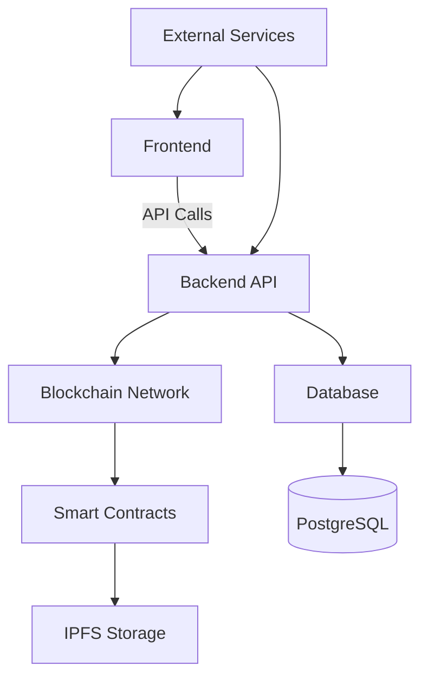
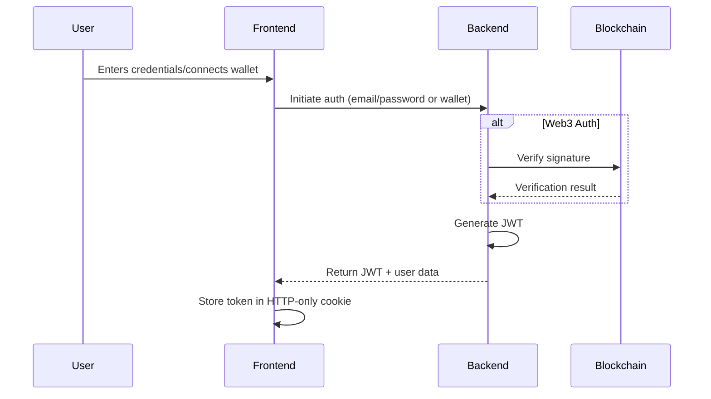
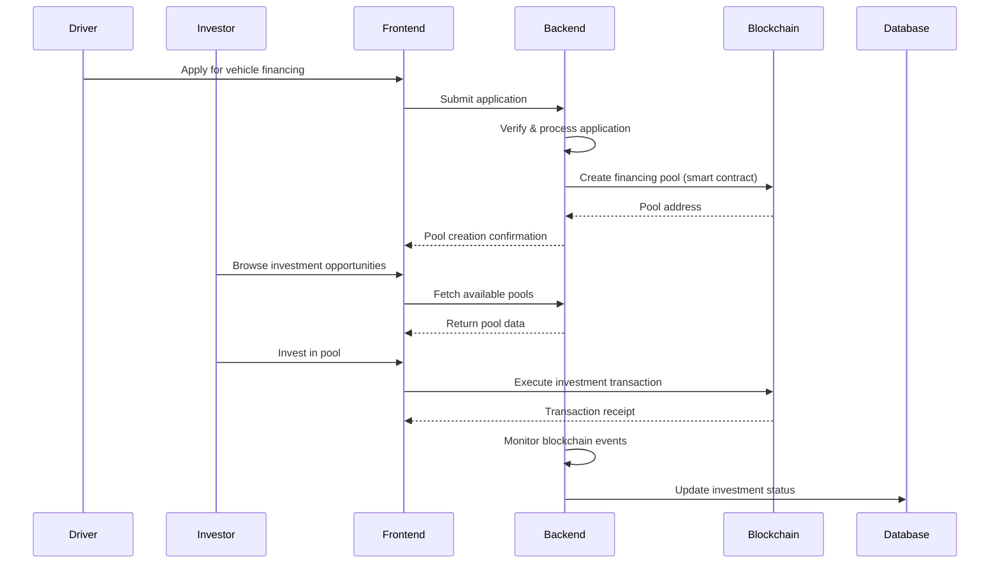
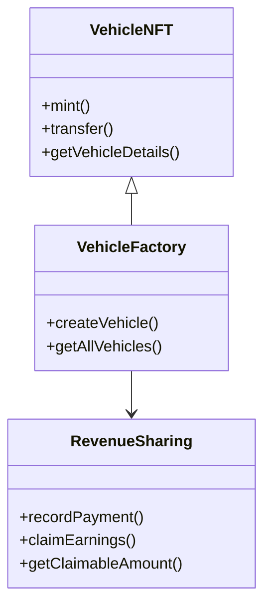
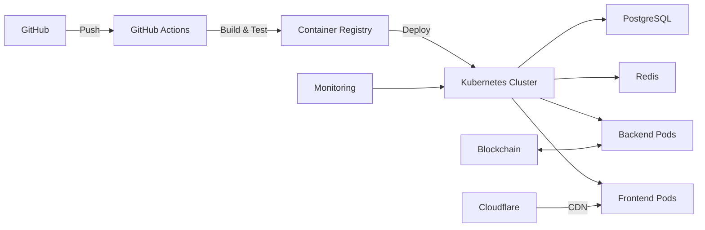

# 🏗️ System Architecture

## 🌐 Overview

ChainMove is a decentralized vehicle financing platform that leverages blockchain technology to create transparent, secure, and efficient vehicle financing solutions. The architecture follows modern web application best practices with a focus on security, scalability, and maintainability.



## 🛠 Tech Stack

### Frontend Layer
- **Framework**: Next.js 13+ with App Router
- **Language**: TypeScript 5.0+
- **UI Library**: React 18+ with Concurrent Features
- **Styling**: Tailwind CSS with CSS Modules
- **State Management**: React Context + useReducer
- **Form Handling**: React Hook Form with Zod validation
- **Data Fetching**: SWR with optimistic updates
- **Web3**: ethers.js v6, Web3Modal
- **Maps**: Mapbox GL JS
- **Charts**: Recharts
- **Testing**: Jest, React Testing Library, Cypress

### Backend Layer
- **Runtime**: Node.js 18+ (LTS)
- **Framework**: Next.js API Routes
- **Database**: PostgreSQL 14+ with Prisma ORM
- **Authentication**: NextAuth.js with JWT & Web3
- **Caching**: Redis
- **Search**: MeiliSearch
- **Email**: Resend
- **Payments**: Stripe Integration
- **Blockchain**: Ethereum, Polygon (Matic)
- **Storage**: IPFS, AWS S3

### Smart Contracts
- **Language**: Solidity 0.8.17+
- **Frameworks**: Hardhat, OpenZeppelin
- **Testing**: Waffle, Chai
- **Security**: Slither, MythX
- **Standards**: ERC-721, ERC-20, EIP-712

### DevOps & Infrastructure
- **Version Control**: GitHub
- **CI/CD**: GitHub Actions
- **Containerization**: Docker, Docker Compose
- **Orchestration**: Kubernetes
- **Hosting**: Vercel (Frontend), AWS ECS (Backend)
- **Monitoring**: Sentry, Prometheus, Grafana
- **Logging**: ELK Stack
- **Analytics**: PostHog, Google Analytics
- **CDN**: Cloudflare

## 🏗 Application Structure

```
chain-move/
├── app/                    # Next.js 13+ app directory (App Router)
│   ├── (auth)/             # Authentication routes
│   │   ├── login/          # Login page
│   │   └── register/       # Registration page
│   ├── (dashboard)/        # Authenticated routes
│   │   ├── investor/       # Investor dashboard
│   │   └── driver/         # Driver dashboard
│   ├── api/                # API routes
│   │   ├── auth/           # Authentication endpoints
│   │   ├── vehicles/       # Vehicle management
│   │   └── investments/    # Investment endpoints
│   └── ...
├── components/             # Reusable UI components
│   ├── ui/                 # Shadcn/ui components
│   ├── dashboard/          # Dashboard components
│   └── web3/               # Web3-specific components
├── config/                 # App configuration
├── contracts/              # Smart contracts
│   ├── artifacts/          # Compiled contracts
│   ├── contracts/          # Solidity source
│   └── test/               # Contract tests
├── hooks/                  # Custom React hooks
├── lib/                    # Utility functions
│   ├── api/                # API clients
│   ├── blockchain/         # Web3 utilities
│   └── utils/              # Helper functions
├── prisma/                 # Database schema
│   ├── migrations/         # Database migrations
│   └── schema.prisma       # Prisma schema
├── public/                 # Static assets
├── styles/                 # Global styles
└── types/                  # TypeScript types
```

## 🔄 Data Flow

### 1. Authentication Flow



### 2. Vehicle Financing Flow



## 🏛 System Components

### 1. Frontend Architecture

- **Page Components**: Server Components for better SEO and performance
- **Client Components**: Interactive UI elements with 'use client' directive
- **State Management**: React Context + useReducer for global state
- **Data Fetching**: SWR with optimistic updates and revalidation
- **Form Handling**: React Hook Form with Zod validation
- **Web3 Integration**: Custom hooks for blockchain interactions

### 2. Backend Architecture

- **API Routes**: RESTful endpoints with Next.js API Routes
- **Authentication**: JWT with refresh tokens, Web3 wallet auth
- **Database**: PostgreSQL with Prisma ORM for type-safe queries
- **Caching**: Redis for frequently accessed data
- **Background Jobs**: BullMQ for queue management
- **Real-time Updates**: WebSockets for live data

### 3. Smart Contract Architecture



## 🔒 Security Architecture

### Authentication & Authorization
- JWT with short-lived access tokens and secure refresh tokens
- Role-based access control (RBAC)
- Web3 wallet signature verification
- Rate limiting and request throttling

### Data Protection
- Encryption at rest (AES-256)
- Encryption in transit (TLS 1.3)
- Secure cookie settings (httpOnly, secure, sameSite)
- CSRF protection
- XSS prevention (Content Security Policy)

### Smart Contract Security
- Comprehensive test coverage
- Formal verification where applicable
- Regular security audits
- Emergency pause functionality
- Upgradeable contracts with timelock

## 📈 Scalability Considerations

### Frontend
- Code splitting with dynamic imports
- Image optimization with Next/Image
- Static site generation (SSG) where possible
- Edge caching with CDN

### Backend
- Horizontal scaling with Kubernetes
- Database read replicas
- Connection pooling
- Caching strategy with Redis

### Blockchain
- Layer 2 solutions (Polygon)
- Gas optimization
- Batch transactions
- Off-chain computation

## 🚀 Deployment Architecture



### Monitoring & Observability
- Application metrics with Prometheus
- Log aggregation with ELK Stack
- Real-user monitoring with Sentry
- Uptime monitoring
- Performance monitoring

## 🔄 CI/CD Pipeline

1. **Code Push**
   - Linting and type checking
   - Unit tests
   - E2E tests
   - Security scanning

2. **Pull Request**
   - Preview deployment
   - Integration tests
   - Code review required

3. **Merge to Main**
   - Build production artifacts
   - Run all tests
   - Deploy to staging
   - Run smoke tests
   - Deploy to production (with approval)
   - Run post-deployment tests

## 📚 Related Documentation

- [API Reference](../api/README.md)
- [Smart Contracts](../smart-contracts/README.md)
- [Deployment Guide](./deployment.md)
- [Testing Strategy](./testing.md)
