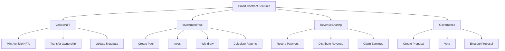
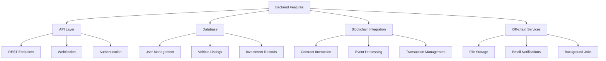
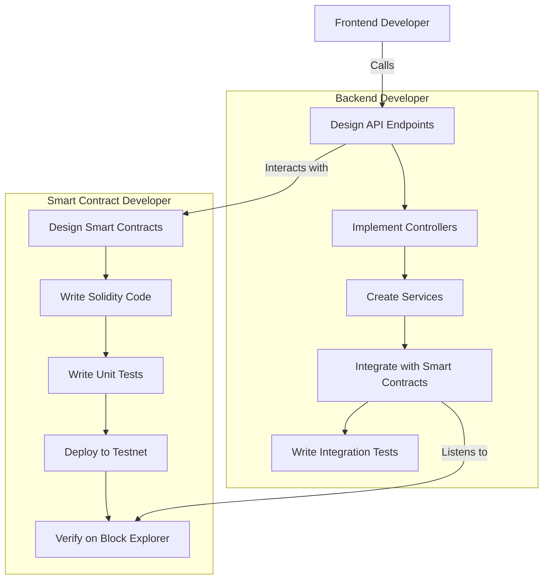

# Developer Guide: Smart Contract & Backend Responsibilities

## Overview

This document outlines the specific responsibilities and features for smart contract and backend developers working on the ChainMove platform. It provides a clear separation of concerns and visual representations of the features each team will implement.

## Smart Contract Developer Responsibilities

### Core Features

1. **Vehicle NFT Management**
   - Implement ERC-721 compatible Vehicle NFTs
   - Handle vehicle ownership transfers
   - Manage vehicle metadata on-chain

2. **Investment Pool Contracts**
   - Create and manage investment pools
   - Handle investor contributions
   - Distribute returns to investors

3. **Revenue Sharing**
   - Implement revenue distribution logic
   - Handle profit sharing between investors and platform
   - Manage payment schedules

4. **Governance**
   - Implement voting mechanisms
   - Handle proposal creation and execution
   - Manage protocol parameters

### Feature Diagram: Smart Contract Features

### Smart Contract Developer Tasks

1. **VehicleNFT Contract**
   - Implement `mint()`: Create new vehicle NFTs
   - Implement `transfer()`: Handle ownership transfers
   - Implement `setTokenURI()`: Update vehicle metadata
   - Events: `Transfer`, `Mint`, `MetadataUpdate`

2. **InvestmentPool Contract**
   - Implement `createPool()`: Initialize new investment opportunities
   - Implement `invest()`: Handle investor contributions
   - Implement `withdraw()`: Process investor withdrawals
   - Events: `PoolCreated`, `Invested`, `Withdrawn`

3. **RevenueSharing Contract**
   - Implement `recordPayment()`: Track revenue from vehicles
   - Implement `distribute()`: Allocate revenue to investors
   - Implement `claimEarnings()`: Allow investors to claim returns
   - Events: `PaymentRecorded`, `RevenueDistributed`, `EarningsClaimed`

## Backend Developer Responsibilities

### Core Features

1. **API Development**
   - RESTful API endpoints
   - WebSocket for real-time updates
   - Authentication & Authorization

2. **Database Management**
   - Schema design and migrations
   - Data validation and sanitization
   - Query optimization

3. **Blockchain Integration**
   - Smart contract interaction
   - Event listening and processing
   - Transaction management

4. **Off-chain Services**
   - File storage (IPFS, S3)
   - Email notifications
   - Background jobs

### Feature Diagram: Backend Features

### Backend Developer Tasks

1. **API Endpoints**
   - User authentication and profile management
   - Vehicle listing and search
   - Investment operations
   - Transaction history

2. **Database Models**
   - Users and authentication
   - Vehicle listings and details
   - Investment records
   - Transaction history

3. **Blockchain Services**
   - Contract deployment helpers
   - Event listeners
   - Transaction queue management

## Feature Implementation Mapping

### Developer Workflow

### Responsibility Matrix

| Feature | Smart Contract Developer | Backend Developer |
|---------|------------------------|-------------------|
| **User Management** | - Wallet connection | User authentication |
| | Signature verification | Session management |
| | On-chain identity | Off-chain profile |
| **Vehicle Listing** | NFT minting | Metadata storage |
| | Ownership transfer | Search & filtering |
| | On-chain verification | Image hosting |
| **Investment** | Pool creation | Payment processing |
| | Token transfers | Investment records |
| | Yield calculation | Transaction history |
| **Revenue** | Distribution logic | Payout processing |
| | Profit sharing | Email notifications |
| | Claim verification | Receipt generation |
| **Governance** | Voting mechanism | Proposal management |
| | Proposal execution | Voter analytics |
| | Parameter updates | UI integration |

### System Integration

1. **Smart Contract Events**
   - Backend listens for on-chain events
   - Updates database accordingly
   - Triggers notifications

2. **API to Smart Contract**
   - Backend signs and sends transactions
   - Handles gas estimation
   - Manages transaction nonces

3. **Data Consistency**
   - Off-chain data mirrors on-chain state
   - Regular reconciliation
   - Conflict resolution

## Development Workflow

1. **Smart Contract Development**
   - Write and test contracts locally
   - Deploy to testnet
   - Verify on block explorer

2. **Backend Development**
   - Implement API endpoints
   - Set up database models
   - Integrate with smart contracts

3. **Testing**
   - Unit tests for contracts and backend
   - Integration tests
   - End-to-end tests

4. **Deployment**
   - Deploy smart contracts
   - Deploy backend services
   - Configure monitoring

## Best Practices

### Smart Contracts
- Follow Solidity style guide
- Implement access control
- Use OpenZeppelin contracts
- Comprehensive test coverage
- Gas optimization

### Backend
- RESTful API design
- Input validation
- Error handling
- Logging and monitoring
- Security best practices

## Troubleshooting

### Common Issues
1. **Transaction Failures**
   - Check gas limits
   - Verify contract addresses
   - Check for revert reasons

2. **Event Not Captured**
   - Verify event signatures
   - Check block range
   - Confirm listener is running

3. **API Timeouts**
   - Check blockchain node connection
   - Review query performance
   - Check for rate limiting

## Support

For issues not covered in this guide, please refer to:
- [API Documentation](../api/README.md)
- [Smart Contract Documentation](../smart-contracts/README.md)
- [Architecture Documentation](./architecture.md)
